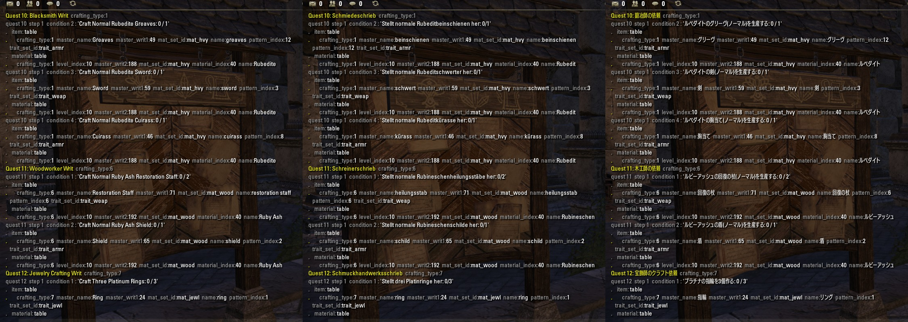

# LibCraftText

Are you an add-on developer who compares quest names against a list of strings to figure out which quest is a daily crafting writ? Master writ?

This is a library of localized strings for crafting quest recognition, and parser code that uses those strings to convert "Craft Normal Ancestor Silk Shoes" into `{ item=SHOES, material=ANCESTOR_SILK }`

Example dump of tables from parsing some daily crafting writ quests, in EN English, DE German, and JA Japanese:



```Lua
LibCraftText.DailyQuestNameToCraftingType("Enchanter Writ")
---> returns CRAFTING_TYPE_ENCHANTING

LibCraftText.ParseDailyCondition(CRAFTING_TYPE_ENCHANTING
            , "Craft Superb Glyph of Health with Ta: 0/1")
---> returns table:
{
    essence = { name="Oko",    item_id=45831, ... }
    potency = { name="Rejera", item_id=64509, ... }
    aspect  = { name="Ta",     item_id=45850, ... }
}

LibCraftText.ParseDailyCondition(CRAFTING_TYPE_CLOTHIER
            , "Craft Normal Ancestor Silk Shoes: 0/1")
---> returns table:
{
    item     = { name="shoes",         mat_set_id=mat_lgt, pattern_index=3, ... }
    material = { name="Ancestor Silk", mat_set_id=mat_lgt, level_index=10, ... }
}

LibCraftText.ParseDailyCondition(CRAFTING_TYPE_ALCHEMY
            , "Acquire Mudcrab Chitin: 3/3")
---> returns table:
{
    item    = { name = "Mudcrab Chitin", item_id=77591, ... }
}

-- and if your ESO UI is set to DE German or some other supported
-- language, then the name strings change, but the numbers don't:

LibCraftText.ParseDailyCondition(CRAFTING_TYPE_ALCHEMY
            , "Besorgt etwas Schlammkrabbenchitin: 3/3")
---> returns table:
{
    item    = { name = "Schlammkrabbenchitin", item_id=77591, ... }
}
```

## GitHub Repo

GitHub repo at [https://github.com/ziggr/ESO-LibCraftText](https://github.com/ziggr/ESO-LibCraftText).

## Supported Languages

- EN English
- DE German
- FR French
- RU Russian [RuESO](https://www.esoui.com/downloads/info1347-RuESO.html)
- ES Spanish [ESO Spanish Translation](https://www.esoui.com/downloads/info838-ESOSpanishTranslationWIP-74.26.html)
- IT Italian [ESO Italian Translation](https://www.esoui.com/downloads/info1067-ESOItalianTranslationWIP.html) has not yet gotten to crafting writs. Not supported.
- JA Japanese [ESO Japanese Translation](https://www.esoui.com/downloads/info2154-ESO-JapaneseLocalization.html)

## Master Writs

**Master writs/Rolis:** As of 2018-11-12, I'm still waiting until ZOS fixes the October 2018 "cannot interact with any crafting stations in player housing" bug that is really making life difficult for guild hall users on both PTS and Live servers.

---
Begin notes to Future Zig: developing LibCraftText


# Design Goal

The goal is a small collection of public APIs that can take any daily or master crafting writ quest and return a set of enums or constants that tell you what to craft.

This is not a translator: it does not answer "tell me how to say 'Rubedite' in German." (Yes, that very answer lurks buried within the lang_db files. But that's not the point of this add-on library.)

# Development Environment

1. Install translation add-ons. See [Supported Languages](#Supported%20Languages) above for the list.
2. Create 10 alts, one for each crafting rank.
    Spread Provisioning Rank 1-3 across all three alliances. You will eventually need AD DC EP rank 1 for three days, then rank AD DC EP rank 2, then rank 3.
3. Modify `LibCraftText.txt` to enable SavedVariables and LibCraftText_Discover.lua.
    That's how you extract strings from the ESO client.

## Alinor: Best City for Daily Crafting Writs

Alinor is the best city for iterating through daily crafting writs. The daily writ boards are next to each other in the center of the crafting area. Almost no walking required.

Buy the **Alinor Crest Townhouse.** Then you can teleport each new alt to that home, walk out the front door, and you're there. _Much faster_ than level 1 horse rides from Shimmerene.

# Development Cycle

## `/lct discover` Discover item and other names

On your Rank 10 alt with complete trait, reagent, and recipe knowledge:

1. `/lct discover` to scan set, trait, and many, many, other strings.
2. Interact with each of 6 crafting stations: BS CL WW JW EN AL (PR not necessary)
3. `/lct lang` to switch to the next language
4. Repeat 1-3 for each supported language

Your SavedVariables $AccountWide is now filled with lots of text. Absorb it into `lang_db.lua` at your leisure.

Step 2 is enough of a hassle that you really don't want to do it often. Which is why `/lct forget` commented out `LibCraftText.saved_var[field]`. If you *really* want to clear out an hour's worth of station-interacting and language-switching, Uncomment that line.

Discover didn't collect all the text you expected? See `LibCraftText.Discover()`. Most of its steps are commented out to save time. Un-comment-out the parts you need.

## `/lct scanlang` Scan daily quests

Learn daily quest text on each of your 10 alts:

1. Log in to alt N
2. `/lct abandon` to abandon all daily crafting quests and forget them from this alt's saved chariables.
3. Interact with crafting writ boards to acquire 7 daily crafting quests.
4. `/lct scanlang` to scan quest journal, record text, and switch to next language
5. Repeat step 4 until you've looped back to your starting language (usually EN English).
6. (Optional) `/lct scan` to display the line of language codes: make sure they're all green:
 <font face="monospace" color="#669966">EN de fr ru es it ja</font>
7. `/logout`
8. Repeat steps 1-7 for each of 10 alts.

Takes about an hour if you're distracted, or half an hour if you're focused.

Your SavedVariables for each alt is now filled with quest text. Absorb it into `lang_db.lua` at your leisure.

## Absorb SavedVariables into `lang_db.lua`

1. `make getpts`: Copy SavedVariables/LibCraftText.lua into data/ .
2. `make lang`: Absorb SavedVariables into `lang_db.lua` by running `lang_gen.lua`.
    (Also generates lang/xx.lua files, but that's not important right now.)

Have you added code to `LibCraftText_Discover.lua` to collect more text? See ??? below.

## Generate test fodder

Add new text to `gen_test.data.lua` so that we can prevent it from breaking:

1. `make lang`: (Optional) pick up any SavedVariables changes you might have missed and absorb them into `lang_db.lua`.
    (Also generates lang/xx.lua files, but that's not important right now.)
2. `make gentest`: Merge text from `lang_db.lua` into `test/gen_test.data.lua`, inserting new lines for new text.
    Expect test to fail if you've added new lines: new lines without expected results should cause the test to fail until you supply expected values, and parser code to satisfy those expected values.

As of 2018-11-13, the gentest generator, data, and runner all know nothing except for daily crafting writs. They will need to be extended to support master writs.

## Test, Code, Repeat

1. `make lang gentest` to update the generated test data, run it against LibCraftText, and fail or pass.
2. Hand-edit `test/gen_test.data.lua` to supply expected results for new lines.
3. Edit `LibCraftText.lua` parser code, or more likely just the regex arrays above the parser code, until your test passes.

## Bad lang_tables

Occasionally `lang_db.lua` will end up with a bad lang_table: a record that lists one thing in EN English, but a different thing in DE German or whatever. Symptom is a `make gentest` that fails, but when you examine the failure report, you can see that the EN English text does not match the meaning of the DE German text or whatever.

Usually these are daily crafting records, not used in `lang_template.txt`. If so, just delete them.

If they are something more permanent, with a key that appears in `lang_template.txt`, you might need to hand-repair them, or delete, regenerate, and inspect.

# TO DO

- [ ] More master writ test fodder
- [ ] Find all master writ recipes
- [ ] harvest Rolis dialog text
- [ ] watch quest status changes as we craft things for a currently active master writ quest (Hey, can Dolgubon's Writ Crafter do this for active quests? That'd be helpful while testing. Don't make me write something...)
- [ ] Use LibCraftText in ZZDailyWrits and WritWorthy_AutoQuest.
- [ ] performance pass: all those ZZDEBUG string.format() calls are gonna hurt. At least re-express them as variadic ... arg lists
- [ ] DRY collapse of all that copypasta

# `/script` commands

## `/script SetCVar("language.2", "en")` switch language

Switches ESO UI to EN English. Reloads UI automatically. Other language codes work.

## `/lct en` switch language
An alias for `SetCVar`. Other language codes work.

## `/lct discover` collect rank-independent text

Iterates through motifs, sets, traits, and more, to collect text for anything that doesn't depend on rank. Takes a long time. Prompts you to interact with each crafting station to gather equipment and other names.

Often much of this `LibCraftText.Discover()` is commented out, because boy howdy it sure takes a long time and hammers the API. Uncomment what you need.

##  `/lct scan` collect rank-dependent daily crafting text

Scans quest journal and collects daily crafting writ strings.

## `/lct lang` switch to next language

## `/lct scanlang` alias for `scan` + `lang`

Scan quest journal, then switch to next language. _Greatly_ accelerates the daily slog through 10 alts.

## `/lct forget` Clear Saved Chariables

Can also clear $AccountWide saved variables, if you comment out one line in `LibCraftText.Forget`

## `/lct abandon` abandon all daily crafting writs

Do this once per alt at the start of each alt's `/lct scanlang` slog.

## `/lct alchemist` learn all alchemy traits

Run this while interacting with an alchemy station to craft 26 potions that learn all 30 alchemy traits on all 28 reagents.

Requires alchemy skill `Laboratory Use` for 3 reagents.
